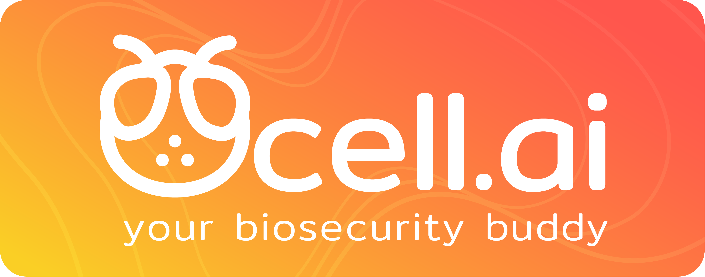

Ocell.ai empowers pest biosecurity personnel by bridging them to the modern tools and insights of AI crafted by multidisciplinary expert entomologists. It is designed to enhance workflow efficiency through its straightforward interface combined with relevant biosecurity information that promote the formation of actionable insights.

## Tech Stack

### Front-end

- **Framework** : React (Version)
- **Libraries**
  - tailwindcss (Version)
  - daisyUI (Version)
  - plotly (Version)
  - axios (Version)

### Backend

- **Framework** : flask (Version)
- **Libraries** :
  - tensorflow (Version)

## Installation and Setup

### 1. Flask Backend

#### `npm run start-backend`

This starts the backend server of the app
Open [http://localhost:5000](http://localhost:5000) to view it in your browser.
You will have to refresh the connection in order to see changes.

#### `./flask-backend/flask/Scripts/activate`

This activates a virtual flask enviorment

### 2. React Front-end

#### `npm start`

This starts up the react front end server of the app.
It should open a tab in your browser at [http://localhost:3000](http://localhost:3000)

#### `npm run electron`

This starts up the react app as an electron application and runs the backend executable as a local server. It also executes the `npm start` simultaneously. 

#### `npm run electron-only`

This starts up the react app as an electron application and runs the backend executable as a local server.

#### `npm run build`

Builds the app for production to the `build` folder.\
It correctly bundles React in production mode and optimizes the build for the best performance.

The build is minified and the filenames include the hashes.\

#### `npm run package`

Packages the app into the dist folder as an executable that when executed installs and launches the electron application.

##### Dependencies:

```
npm install react react-dom
npm install -D tailwindcss
npm i -D daisyui@latest
npm i --save plotly.js-dist-min
npm install axios
```

## Usage Examples

## Project Management Tool

## Future Plans

## Project Management Tool

## Acknowledgements


