Ocell.ai empowers pest biosecurity personnel by bridging them to the modern tools and insights of AI crafted by multidisciplinary expert entomologists. It is designed to enhance workflow efficiency through its straightforward interface combined with relevant biosecurity information that promote the formation of actionable insights.

## Downloads

- Windows Application: [https://drive.google.com/uc?export=download&id=1OcUPP_2evQRGtfKl3fLw3xJAsxfj_kFk](https://drive.google.com/uc?export=download&id=1OcUPP_2evQRGtfKl3fLw3xJAsxfj_kFk)

## Tech Stack

### Front-end

- **Framework** : React (18.2.0)
- **Languages** : JavaScript, HTML, CSS
- **Libraries**
  - tailwindcss (3.3.3)
  - daisyUI (3.7.3)
  - plotly (2.26.1)
  - axios (1.4.0)
  - electron (27.0.0)
  - express (4.18.2)

### Backend

- **Framework** : Flask (3.0.0)
- **Languages** : Python
- **Libraries** :
  - Please see `mac_requirements.txt` and `windows_requirements.txt` in `/flask-backend`

## Installation and Setup

### Development Environment Setup
#### Frontend Setup 

In order to run this application you will need to install Node.js. You can download the installer from
[https://nodejs.org/en/download/](https://nodejs.org/en/download/).

Select version 18.17.1 LTS (Recommended For Most Users) and follow the installation instructions.

Once done, check the versions of your node and npm by running the following commands in your terminal:

```
node -v
npm -v
```

It should return the following versions:

```
v18.17.1
9.6.7
```

Next, execute the following to install additional dependencies:
```
npm install react react-dom
npm install electron-builder --save-dev
npm install express --save
npm install -D tailwindcss
npm i -D daisyui@latest
npm i --save plotly.js-dist-min
npm install axios
```

#### Backend Setup
<u>Prerequisites</u> 
- `Python 3.9` or above
- `pip` package manager

##### For Windows
1. From your teminal, navigate to `/flask-backend`
2. Execute the following commands:
```
py -m pip install --user virtualenv

py -m venv env

env\Scripts\activate

py -m pip install -r windows_requirements.txt
```
3. To start the standalone backend server, execute `flask run`. Please make sure that no other applications / processes are using port `5000`. 

4. To deactivate the virtual environment, run `deactivate`


##### For Mac
1. From your teminal, navigate to `/flask-backend`
2. Execute the following commands:
```
python3 -m pip install --user virtualenv

python3 -m venv env

source env/bin/activate

python3 -m pip install -r mac_requirements.txt
```
3. To start the standalone backend server, execute `flask run`. Please make sure that no other applications / processes are using port `5000`. 

4. To deactivate the virtual environment, run `deactivate`

#### Image Recognition Model Setup


Due to some limitatations on the maximum size of files that can be uploaed to GitHub, we could not incorporate the image recognition model into this repository. 

To import the model locally (after cloning this repository), please navigate to the `/flask-backend/app/data/ml/models/trupanea` directory. 

Then, create a new folder named `inceptionv3` and place your Trupanea InceptionV3 `.h5` model file, named `model.h5` into it. 

Please verify the the following file path now exists:
`/flask-backend/app/data/ml/models/trupanea/inceptionv3/model.h5`

One option to circumvent this issue is to use the Git Large File Storage Extension as a way of accommodating the machine learning models in this Github repository. 

### Flask Backend Commands

Below commands can be executed from the project root directory.

##### `npm run start-backend`

This starts the backend server of the app
Open [http://localhost:5000](http://localhost:5000) to view it in your browser.
You will have to refresh the connection in order to see changes.


##### `npm run build-exe`

This will run the `build.py` python file located at `/flask-backend/build_script` which creates an executable file under `/flask-backend/build_script/packaged_backend/ocellai_backend`. When executed, this program starts the backend server.

### React Frontend Commands

Below commands can be executed from the project root directory.

##### `npm start`

This starts up the react front end server of the app.
It should open the application's web interface tab in your browser at [http://localhost:3000](http://localhost:3000). Please make sure that no other applications / processes are using port 3000. 

##### `npm run build`

Builds the app for production to the `build` folder.\
It correctly bundles React in production mode and optimizes the build for the best performance.

##### `npm run electron`

This starts up the react app as an electron application and runs the backend executable as a local server.

##### `npm run package`

Packages the app and puts it into the `/dist` directory as an executable installer which allows the user to install the application onto their device. Please note that the final installer is specific to the operating system (e.g., Windows, MacOS) on which it was generated.


### Running the application in a development setting

#### Option 1 - manually
Open two terminal windows. 

In the first terminal window, navigate to the project root directory and run `npm start`. A new browser tab with the application interface will open.

In the second terminal window, navigate to `/flask-backend` and run `flask run`. 

Once both the frontend and backend servers are running, refresh the browser page before usage. 


#### Option 2 - using Electron

From the project root directory, run `npm run build-exe` which will build the backend executable and will act has the local server for the flask backend.

Next you will need to run `npm run build` which will compile the react front end code into a smaller and easier to run version within the `/build` directory.

Finally, if you run `npm run electron`, the electron application will launch along with the python executable, and you should be able to use Ocellai and all of its features. (Assuming all of the dependencies have been installed)

#### Troubleshooting

If there is an error when identifying images through this application, try the following possible fixes before contacting the development team.

1. Refresh the app using `ctrl+R`
2. Close the application window and reopen it.
3. Check what image type you are uploading. You might be uploading a corrupt/invalid image.


## Executable Package Installation

After you have generated the executable package (or have downloaded the one from the `Downloads` section), you will need to install the application locally through the installer you downloaded from the `/dist` folder (or the `Downloads` section of this README).

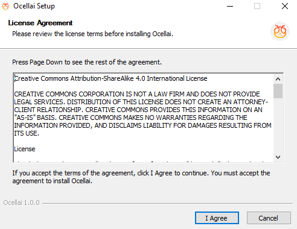

You will be asked to pick a directory to intall the application into. Please select a path which is not within a OneDrive directory.

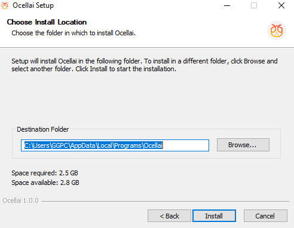

Once the installation has finished you can run the application.

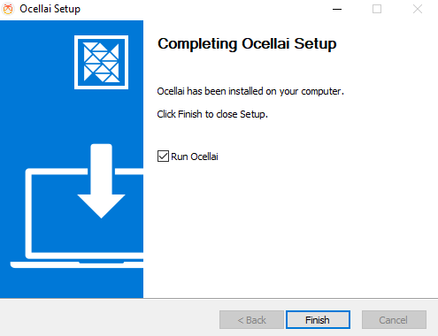

Here is the home page of this app.

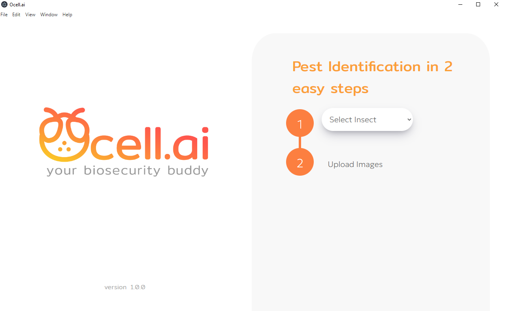

The first thing you will need to do is select an insect type. Each insect type in the dropdown represents a machine learning model in the backend layer which is used to process your images. As more models get added, more 'insect type' options will appear.

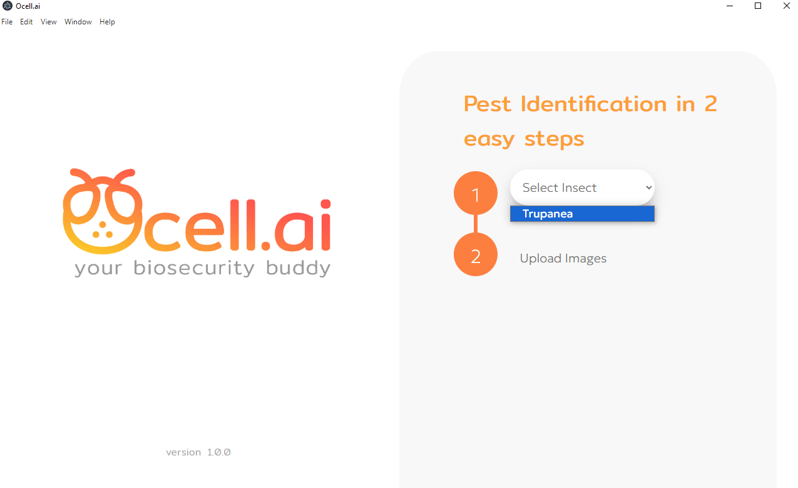

Now you can select any images you want to classify. While there is no maximum number of images you can upload at once, we recommend uploading no more than **40 images** at once. Otherwise, the loading time for all those image will be quite long. If you accidently select the wrong images or want to add more, there is a button to remove a selected image (the red x to the right of the image name) and add more (the 'add images' button).

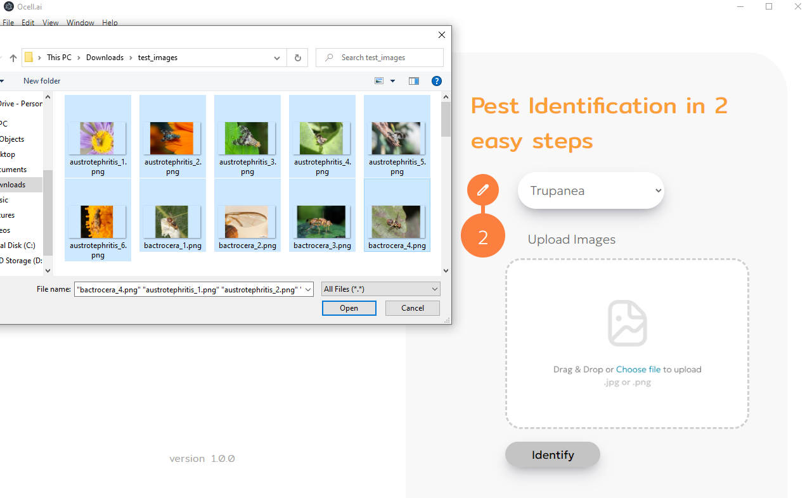

Once you have selected your images you are ready to click 'identify' and see your results.

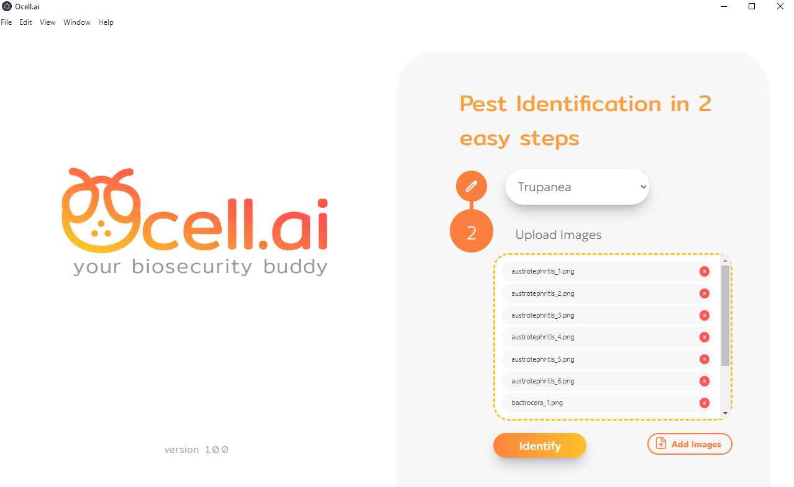

The machine learning model of your choice is now processing your images.

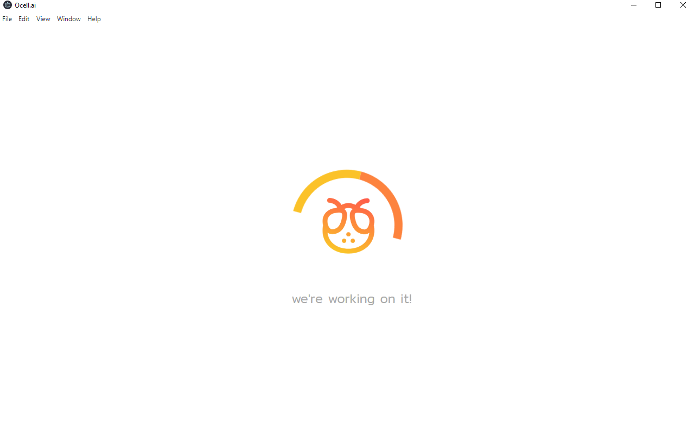

Once finished, you will automatically be directed to the results page. On the left hand side of the screen, we can see a list of all the uploaded images which gives you the option to select each image and see the individual prediction scores for it.

As seen in the image below, the top 3 insects with the highest probability scores are displayed in cards following a podium-like arrangement.

At the bottom of the screen, we can see the full list of the top 10 insect labels with the highest probability scores. On the left, you can see the input image to which these predictions correspond.

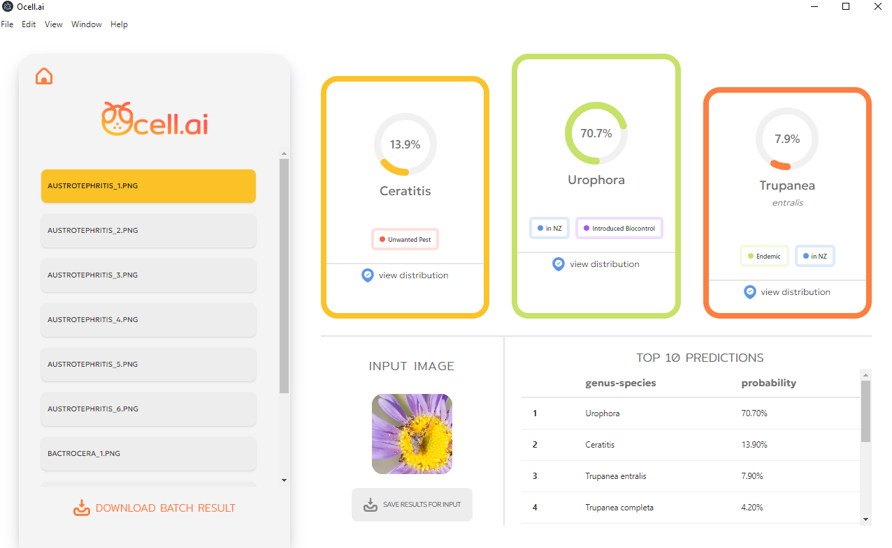

For some cards, a 'view distribution' button with a blue icon will be available at the footer. You can use this to view where in the world the species has been present. Below this map, there are external links to the gbif.org database for reference images of the species and its other taxonomical information.

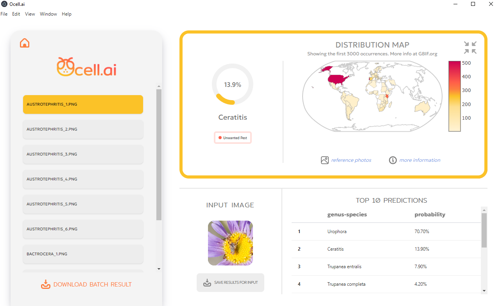

You also have the ability to download a csv file of all the predictions for each of the selected images.

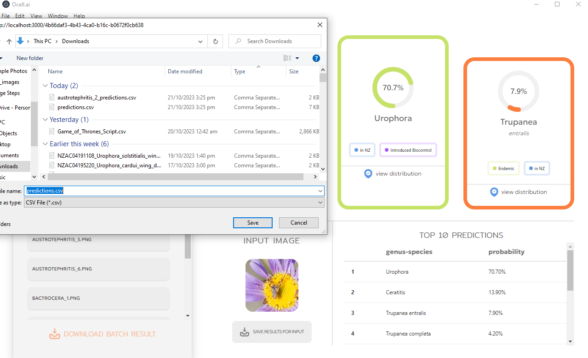

There is also an option the download a csv file with all the predications for a specific image.

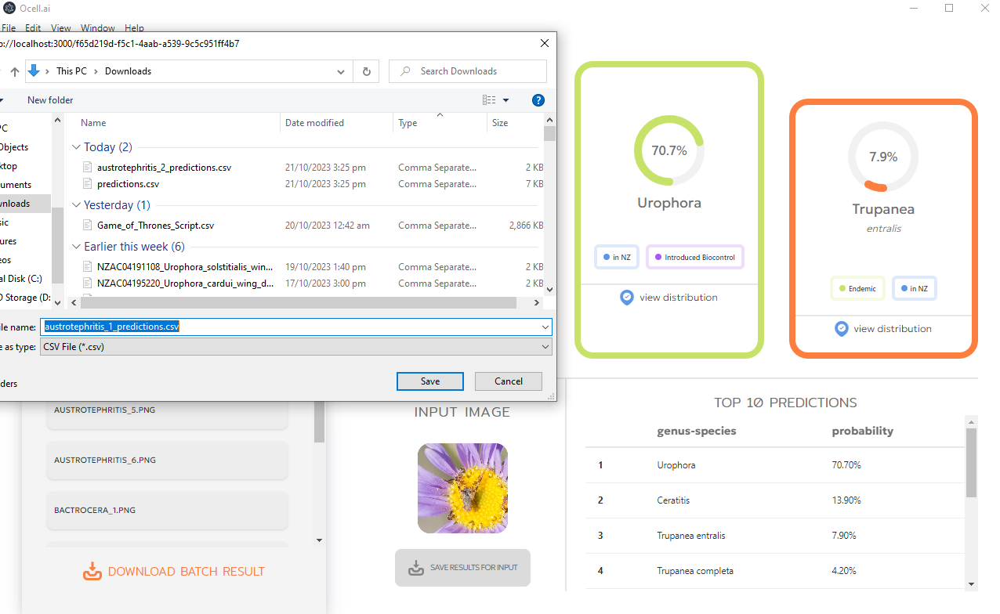

Once you have analysed the prediction results, you can click the home button and navigate to the home page. From there, you can submit more images for classification. 

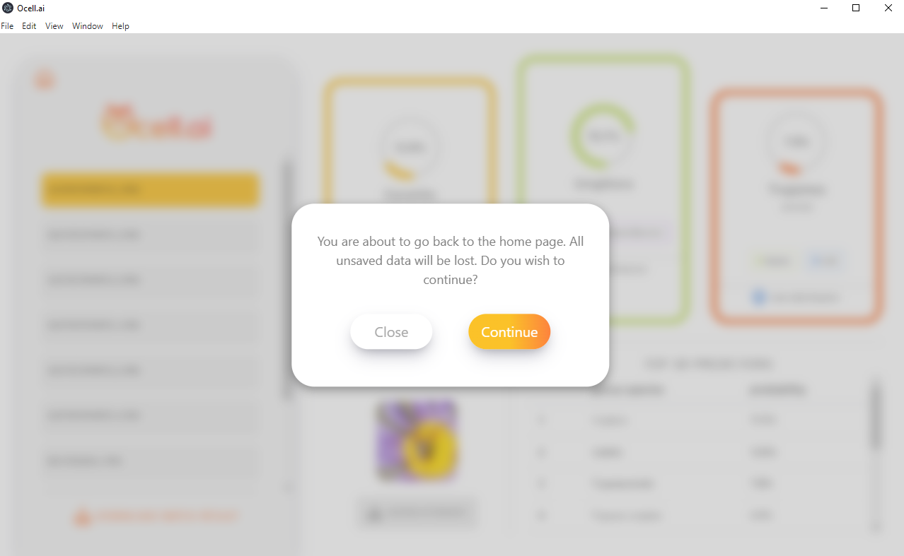

## Adding New Image Recognition Models

Currently, this process requires changes to codebase's directory structure. However, this can be incorporated into the user interface in future development iterations. 

To add a new model, plese follow these instructions:

1. First, you'll need to make a new folder in `/flask-backend/app/data/ml/models/<new model>`. The name of this folder will be visible in the model selection dropdown within the user interface. For example, the current Trupanea's model directory is the following: `/flask-backend/app/data/ml/models/trupanea/`.

2. Next, create 2 more folders in the new model directory: one needs to be named `labels`, and the other needs to be named after the specific version / type of your model (e.g., `inceptionv3` for the current Trupanea model).

3. Within `/flask-backend/app/data/ml/models/<model_name>/labels` add a labels.csv file containing a list of labels that your model supports. Refer to `/flask-backend/app/data/ml/models/trupanea/labels/labels.csv` for an example.

4. Within `/flask-backend/app/data/ml/models/<model_name>/<model_version>`, put the `.h5` model file, which needs to be called `model.h5`. At the moment, only `.h5` model format is supported, but could be extended in the future development iterations. 

After completing the steps above, the program should automatically recognise the new model file, allowing you to select the new model in the selection dropdown within the home page of the application.

## Future Plans

### Maintenance

Currently, updating the application proves to be tedious as it requires the end-user to uninstall the application and reinstall it with an updated packaged version (if distributed as a compiled package). 

However, Electron allows for the deployed application to be connected to a GitHub repository such any changes made in the repository itself should automatically be reflected in the application without needing to reinstall it. This could be another feature to implement in the future.

### Packaging and Distribution

If resources permit, this project could be easily deployed as a Web Application accessible to a wide range of users over the Internet from a browser. This would make maintanence much more efficient as the end-users would not need to download and install a new application executable after each update. This would also allow for the application to be used on mobile devices, which would be highly beneficial for this field work.

## Additional Documentation on Notion

You can view and edit the detailed ocellai codebase documentation in     
[https://glory-height-7f6.notion.site/Ocell-ai-Documentation-930eb1cf9de94f2ea7a19e4af8b2b85b?pvs=4](https://glory-height-7f6.notion.site/Ocell-ai-Documentation-930eb1cf9de94f2ea7a19e4af8b2b85b?pvs=4)

### User Experience

Geared towards aiding biosecurity personnel, we believe the following additional features could be implemented to enhance user experience and promote the reliability of the application:

- **Image Cropping** - The ability to crop images to focus on the insect of interest.
- **Image Rotation** - The ability to rotate images to the correct orientation.
- **Extended Species Information** - The addition of extensive yet necessary details about the morphological features of the insect of interest throughout the stages of its lifecycle. This would allow the user to make more informed decisions, as it would acquaint them with pest insects whose adult appearance are not as distinct as others.
- **Addition of Crucial Biosecurity Information** - Information such as the host of the pest insect along with its natural enemies would present a more holistic approach to pest management.

## Project Management Tool

Below is a screenshot of Team 35's Gantt Chart for this project.

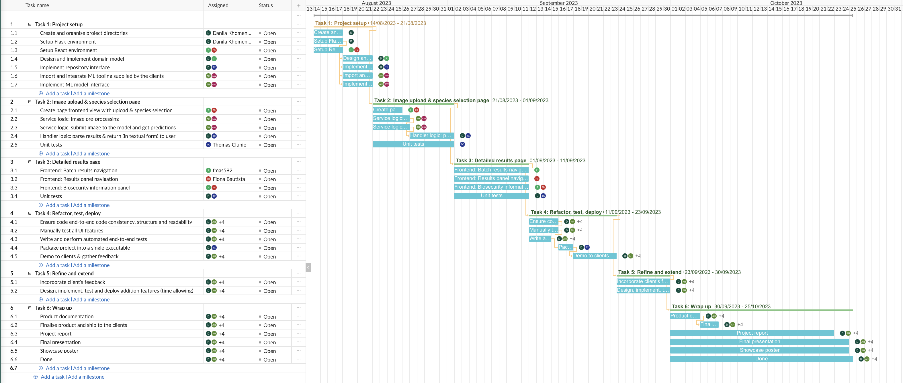

## Acknowledgements

Darren Ward and Aaron Harmer, for providing the machine learning model and pest insect data used in this project.

---

Brought to you by Team 35

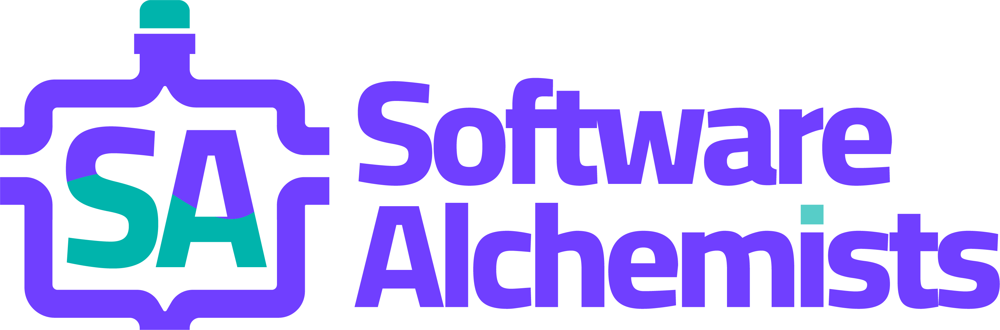

- Dan Khomenko - Team Leader/Backend Developer
- Fiona Bautista - Frontend Developer/ UI/UX Designer
- Tom Clunie - Backend Developer/Unit Testing
- Aaron Heald - Backend Developer
- Finn Massey - Lead Frontend Developer
- Alex Wardega - Backend Developer
